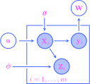
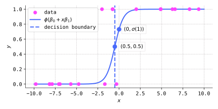
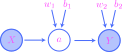
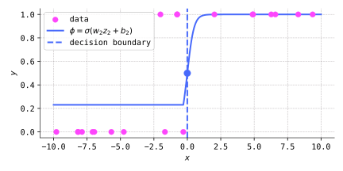

# Homework for [Chapter 11: Probabilistic graphical models](https://mml.johnmyersmath.com/stats-book/chapters/11-models.html)

**Due date**: Monday, April 1

**Guidelines:** You are free to work and collaborate with your classmates, but you must turn in your own written solutions. Do not consult any outside resources for your solutions, including anything on the web. Late submissions will not be accepted.

**List of problems:**

1. [Section 11.1: Examples of causal structures](#problem-1-examples-of-causal-structures)
2. [Section 11.1: Constructing causal structures](#problem-2-constructing-causal-structures)
3. [Section 11.2: Practice with plate notation](#problem-3-practice-with-plate-notation)
4. [Section 11.2: A PGM for clustered data](#problem-4-a-pgm-for-clustered-data)
5. [Section 11.3: Linear regression models and multivariate normal vectors](#problem-5-linear-regression-models-and-multivariate-normal-vectors)
6. [Section 11.3: Expectations of residuals in linear regression models](#problem-6-expectations-of-residuals-in-linear-regression-models)
7. [Section 11.3: Interpreting linear regression parameters](#problem-7-interpreting-linear-regression-parameters)
8. [Section 11.4: The derivative of the sigmoid function](#problem-8-the-derivative-of-the-sigmoid-function)
9. [Section 11.4: Goodness of fit of logistic regression models](#problem-9-goodness-of-fit-of-logistic-regression-models)
10. [Section 11.5: Practice with drawing neural networks](#problem-10-practice-with-drawing-neural-networks)
11. [Section 11.5: A thin neural network](#problem-11-a-thin-neural-network)

 **Tips (to maximize your grade)**:
 
1. Show all relevant steps in all computations. However, I do not need to see trivial things like, for example, the intermediate steps in computing an integral. But if there is a key step in a set of computations that you skip over, I'll have to remove a point or two. Use your best judgment.

2. Explain your work and reasoning using complete and grammatically correct sentences. (It is a myth that mathematicians, engineers, and scientists are all bad at writing. We do many goodly words!)
 
3. Use correct notation.

4. Your goal is to demonstrate your depth of understanding, not simply that you obtained the correct answer. Your goal is to _explain_, as if you're trying to teach me the material.

5. Figure out the answer before writing! More precisely: Carry through your initial computations on your own scratch paper before writing your solutions.  It is difficult to follow a solution that is written in a "stream-of-consciousness" style. If I can't follow along, I am likely to give up and take off points (even if your final answer is right).

## Problem 1: Examples of causal structures

(_From [Section 11.1](https://mml.johnmyersmath.com/stats-book/chapters/11-models.html#a-brief-look-at-causal-inference)_.) Suppose $X$, $Y$, and $Z$ are three random variables. Give a concrete example of:

**(a)**: A situation where $Y$ serves as a confounding variable in the causal structure.

**(b)**: A situation where $Y$ serves as a mediating variable in the causal structure.

Of course, you may not use any of the examples we discussed in class.

## Problem 2: Constructing causal structures

(_From [Section 11.1](https://mml.johnmyersmath.com/stats-book/chapters/11-models.html#a-brief-look-at-causal-inference)_.) Suppose that we have four binary random variables $C$, $R$, $W$, and $S$, which indicate whether it is cloudy ($C$), whether it is raining ($R$), whether the grass is wet ($W$), and whether the sprinkler is running ($S$). Draw a plausible graph depicting the cause and effect relationships between these variables.

## Problem 3: Practice with plate notation

(_From [Section 11.2](https://mml.johnmyersmath.com/stats-book/chapters/11-models.html#general-probabilistic-graphical-models)_.) Explicitly draw the full graphical structure for the following plated probabilistic graphical model when $m=2$. Then, answer the questions that follow.

&nbsp;

  

&nbsp;

Assuming your drawing is correct, you should have a graph with ten nodes. Of these ten nodes, which are...

**(a)**: ...random?

**(b)**: ...deterministic?

**(c)**: ...parameters?

**(d)**: ...observed?

**(e)**: ...hidden?

**(f)**: ...hidden and random?

**(g)**: ...hidden and deterministic?

**(h)**: ...observed and random?

**(i)**: ...observed and deterministic?

## Problem 4: A PGM for clustered data

(_From [Section 11.2](https://mml.johnmyersmath.com/stats-book/chapters/11-models.html#general-probabilistic-graphical-models)_.) We believe that an observed dataset clusters into two groups of normally distributed data, the first of mean $\mu_0$ and variance $\sigma_0^2$, and the second of mean $\mu_1$ and variance $\sigma_1^2$. Though we cannot directly observe which cluster a given data point belongs to, we do know that the probability that a given data point falls in the second cluster is $\theta$. Describe a probabilistic graphical model for this data. (Draw the underlying graph, including all random variables and parameters. Indicate which variables are observed and which are hidden. Describe the distributions of all random variables, along with all link functions.)

## Problem 5: Linear regression models and multivariate normal vectors

(_From [Section 11.3](https://mml.johnmyersmath.com/stats-book/chapters/11-models.html#linear-regression-models)_.) Write the data likelihood function of a linear regression model (in [this](https://mml.johnmyersmath.com/stats-book/chapters/11-models.html#linear-reg-data-pf-thm) theorem) as the density of a multivariate normal distribution. What is the dimension of the distribution? What is the mean vector $\boldsymbol{\mu}$? What is the covariance matrix $\boldsymbol{\Sigma}$?

## Problem 6: Expectations of residuals in linear regression models

(_From [Section 11.3](https://mml.johnmyersmath.com/stats-book/chapters/11-models.html#linear-regression-models)_.) Let

$$
R = Y - \beta_0 - \mathbf{X}^\intercal \boldsymbol{\beta}
$$

be the residual term in a linear regression model. Prove that $E(R)=0$.

## Problem 7: Interpreting linear regression parameters

(_From [Section 11.3](https://mml.johnmyersmath.com/stats-book/chapters/11-models.html#linear-regression-models)_.) Consider the Ames housing dataset with

$$
Y = \text{price} \quad \text{and} \quad X = \text{area}.
$$

As we will see in the [next chapter](https://mml.johnmyersmath.com/stats-book/chapters/12-learning.html), we may train a linear regression model

$$
Y \mid X  \sim N(\mu,\sigma^2), \quad \mu = \beta_0 + x \beta_1,
$$

on the data and obtain $\beta_1 \approx 0.11$. Interpret the meaning of this parameter in terms that an average person on the street would understand.

(If you tell me $\beta_1$ is the slope of a line, you're getting half credit. :grimacing: There's a much better answer than this! In the real world, you might imagine being asked a question very similar to this, especially by clients or stakeholders with non-technical backgrounds. They want _real_ answers with _concrete insight_, not technical jargon about lines and probabilistic models and whatnot. So, get comfortable with ambiguous questions!)

## Problem 8: The derivative of the sigmoid function

(_From [Section 11.4](https://mml.johnmyersmath.com/stats-book/chapters/11-models.html#logistic-regression-models)_.) Show that the derivative of the sigmoid function satisfies the relation

$$
\frac{\text{d}\sigma}{\text{d}x}(x) = \sigma(x) \left[1-\sigma(x)\right].
$$

## Problem 9: Goodness of fit of logistic regression models

(_From [Section 11.4](https://mml.johnmyersmath.com/stats-book/chapters/11-models.html#logistic-regression-models)_.) Given a bivariate observed dataset

$$
(x_1,y_1),(x_2,y_2),\ldots,(x_m,y_m) \in \mathbb{R}^2,
$$

we saw in class that we may visualize the "goodness of fit" of a linear regression model by plotting the regression line $y = \beta_0 + x\beta_1$ over a scatter plot of the data. If instead the dataset is of the form

$$
(x_1,y_1),(x_2,y_2),\ldots,(x_m,y_m) \in \mathbb{R} \times \\{0,1\\},
$$

we may do something similar with a logistic regression model by plotting the curve $y = \sigma(\beta_0 + x \beta_1)$ over a scatter plot:

&nbsp;

  

&nbsp;

The decision boundary corresponds to the $x$-value for which $\beta_0 + x\beta_1=0$, as described in class.

**(a)**: How many data points does the model misclassify as belonging to class $1$, when they are truly in class $0$?

**(b)**: How many data points does the model misclassify as belonging to class $0$, when they are truly in class $1$?

**(c)**: Find the values of the parameters $\beta_0$ and $\beta_1$ for this model.

## Problem 10: Practice with drawing neural networks

(_From [Section 11.5](https://mml.johnmyersmath.com/stats-book/chapters/11-models.html#neural-network-models)_.) Draw a fully-connected, feedforward neural network (in [this](https://mml.johnmyersmath.com/stats-book/_images/nn-neuron-02.svg) style) that has an input layer consisting of $6$ nodes and three hidden layers consisting (from left to right) of $5$, $4$, and $2$ neurons. What is the depth of this network? What are its widths?

## Problem 11: A thin neural network

(_From [Section 11.5](https://mml.johnmyersmath.com/stats-book/chapters/11-models.html#neural-network-models)_.) Consider the same dataset that we used in [Problem 9](#problem-9-goodness-of-fit-of-logistic-regression-models). Using techniques that we will learn in the [next chapter](https://mml.johnmyersmath.com/stats-book/chapters/12-learning.html), we may train a network of the following architecture on this dataset:

&nbsp;

  

&nbsp;

Notice that all layers have width $1$, i.e., everything in sight is a scalar, not a vector. Plotting $y=\sigma(w_2 a + b_2)$ as a function of $x$ over a scatter plot of the data reveals the following:

&nbsp;

  

&nbsp;

**(a)**: Write down an explicit piecewise formula for $y = \sigma(w_2a+b_2)$ as a function of $x$. (_Hint_: You'll need to recall the functional dependence of $a$ on $x$. You can verify if your answer is correct by plotting your formula and checking that it matches the curve in the figure above.)

**(b)**: Using your formula in (a), find a formula for the $x$-value of the decision boundary in terms of the four parameters $w_1,b_1,w_2,b_2$.

**(c)**: The training process yields the following values (rounded to four decimal places) for the parameters:

$$
w_1 = 1.9553, \quad b_1 = 0.5873, \quad w_2 = 2.0696, \quad b_2 = -1.2039.
$$

Using your formula in (b), find the $x$-value of the decision boundary in the figure above. Round your answer to four decimal places. (_Hint_: The answer is _not_ $0$.)
