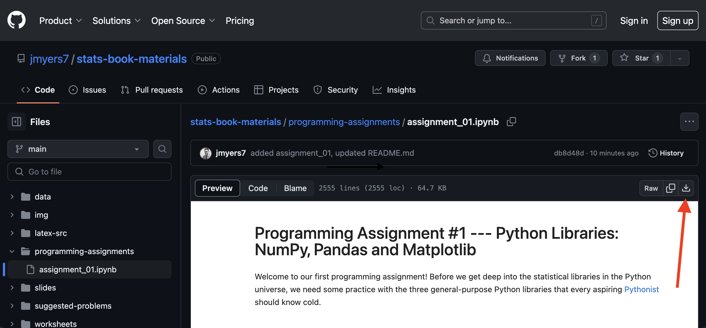
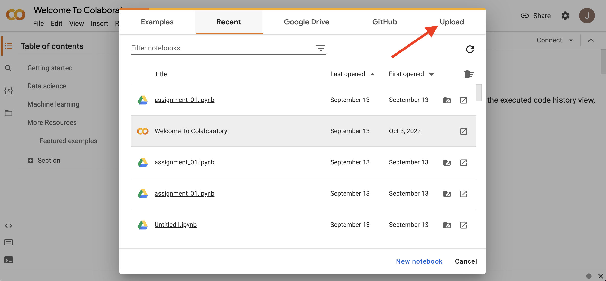

# How to open assignment in Google Colab

1. Open the assignment by clicking this [link](./assignment_13.ipynb). This will open a preview of the assignment in GitHub.

2. With the assignment open in GitHub, click on the button in the upper-right hand corner labeled "Download raw file" shown in the picture below (see the red arrow). This will download the notebook file to your computer (with extension `.ipynb`.)

&nbsp;

  

&nbsp;

3. Navigate to [Google Colab](https://colab.google/) in your browser. Open Colab and click on the "Upload" button, as shown in the picture below (see the red arrow). Upload the notebook file that you downloaded in step 2.

&nbsp;

  

&nbsp;

4. If your upload was successful, you should see the assignment as in the picture below.

&nbsp;

  

&nbsp;